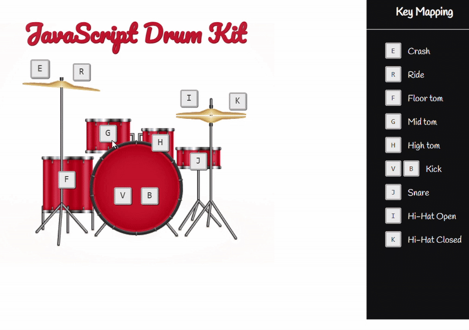

# JavaScript Drum Kit (HTML/CSS/JS)

A fun keyboard-controlled drum kit with animated cymbals and visual key highlights.

## Demo


## Key Mappings
`E` Crash • `R` Ride • `F` Floor Tom • `G` Mid Tom • `H` High Tom • `V/B` Kick • `J` Snare • `I` Hi-Hat Open • `K` Hi-Hat Closed

## Features
- Play sounds via keyboard
- Animated crash/hi-hat
- Key highlight on press
- Simple, responsive layout

## Built With
- HTML, CSS, Vanilla JavaScript
- Audio: `.wav` files (preloaded via `<audio data-key>`)

## How to Run
1. Clone the repo:
   ```bash
   git clone https://github.com/<your-username>/<your-repo>.git
   cd DrumKit
2. Open index.html in your browser (best with Live Server).
